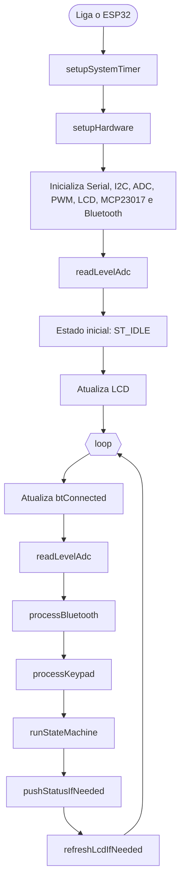
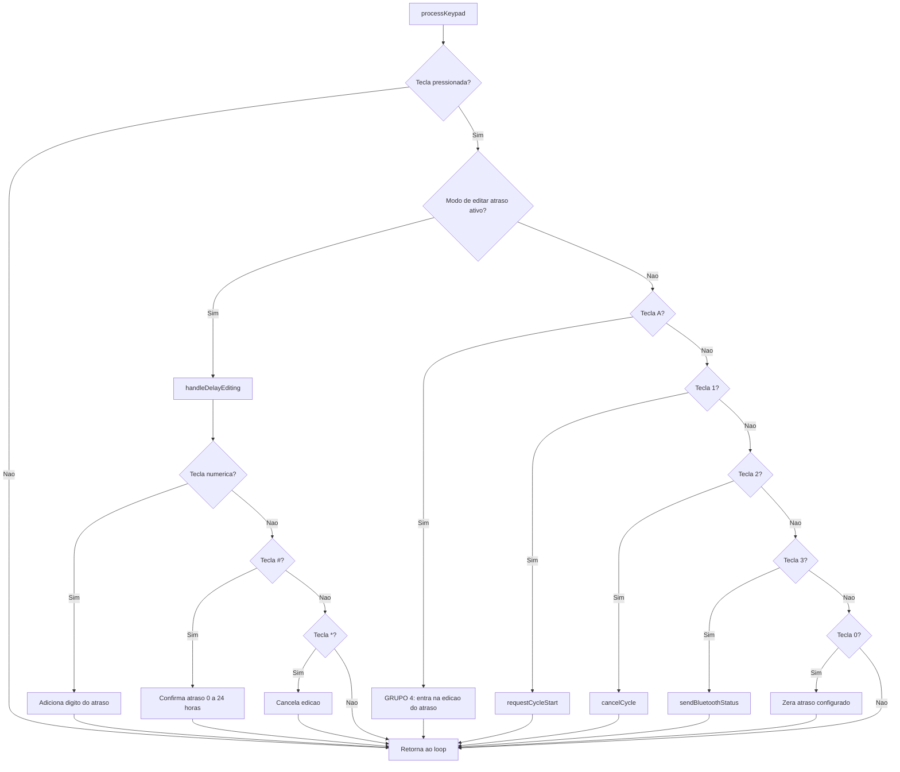
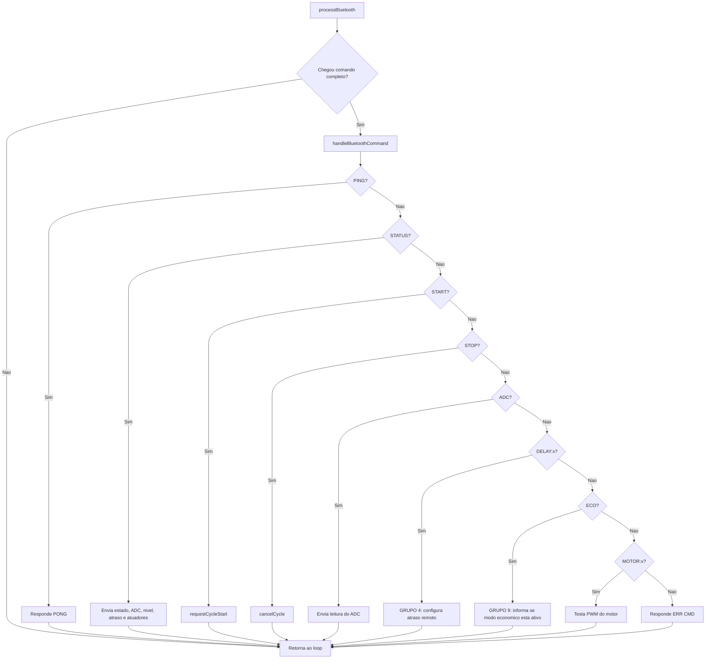
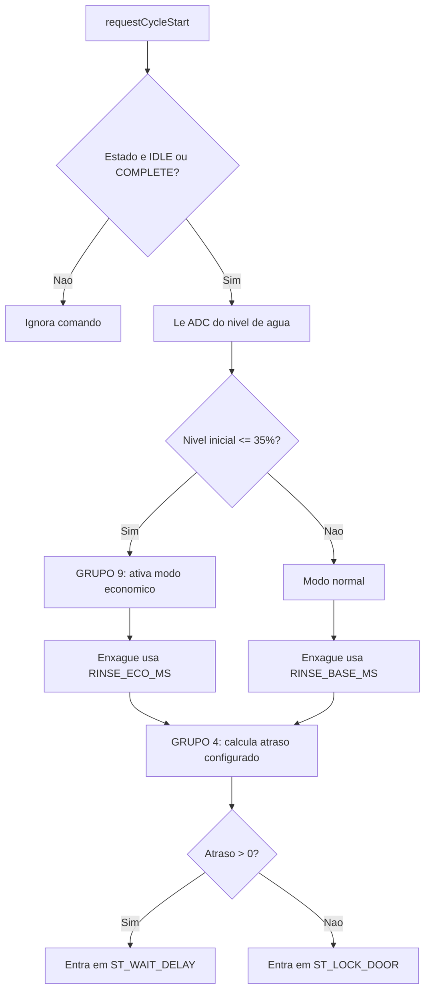
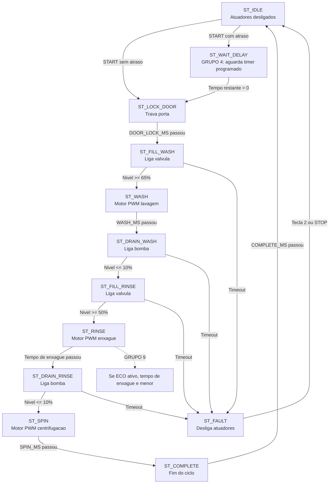

# Fluxograma do Firmware

Este fluxograma representa o funcionamento completo do sketch `Microcontroladores.ino`.

## Fluxo Geral

## Entradas do Usuario

## Inicio do Ciclo

## Maquina de Estados

## Onde Estao os Requisitos Especificos

- Grupo 4, Modo Atraso: constantes `DEMO_DELAY_PER_HOUR_MS`, variaveis `delayEditMode`, `configuredDelayHours`, `scheduledDelayMs`, funcao `handleDelayEditing()`, comando Bluetooth `DELAY:x`, estado `ST_WAIT_DELAY` e calculo em `remainingDelayMs()`.
- Grupo 9, Ciclo Economico Adaptativo: constantes `ECO_START_THRESHOLD_PCT`, `RINSE_BASE_MS`, `RINSE_ECO_MS`, variavel `ecoModeActive`, decisao em `requestCycleStart()` e uso de `rinseDurationMs` no estado `ST_RINSE`.
