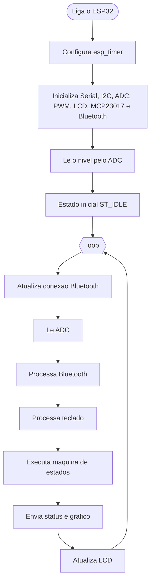
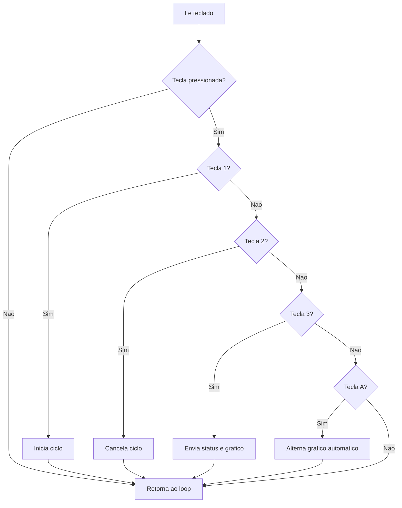
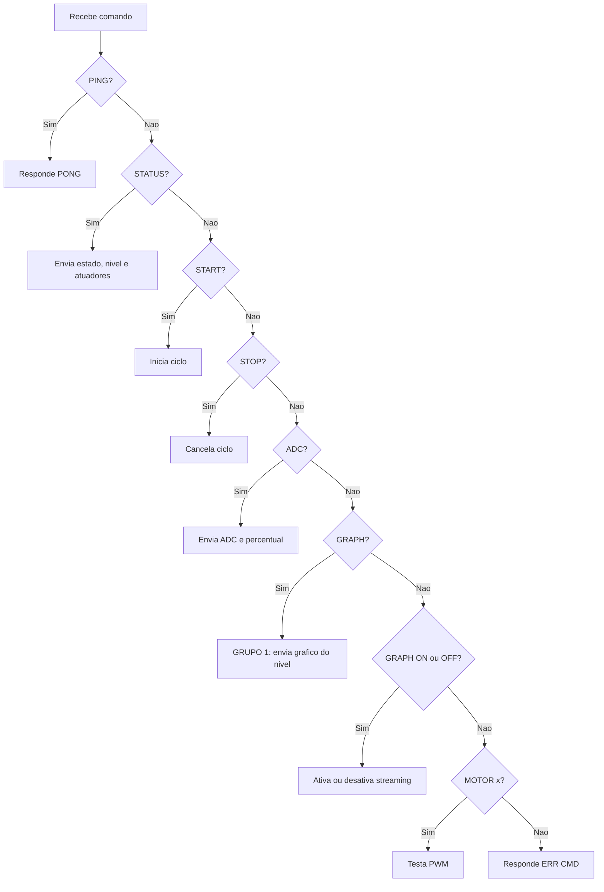
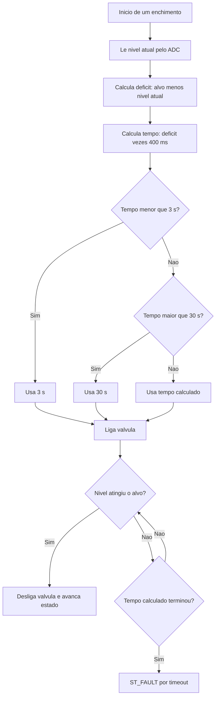
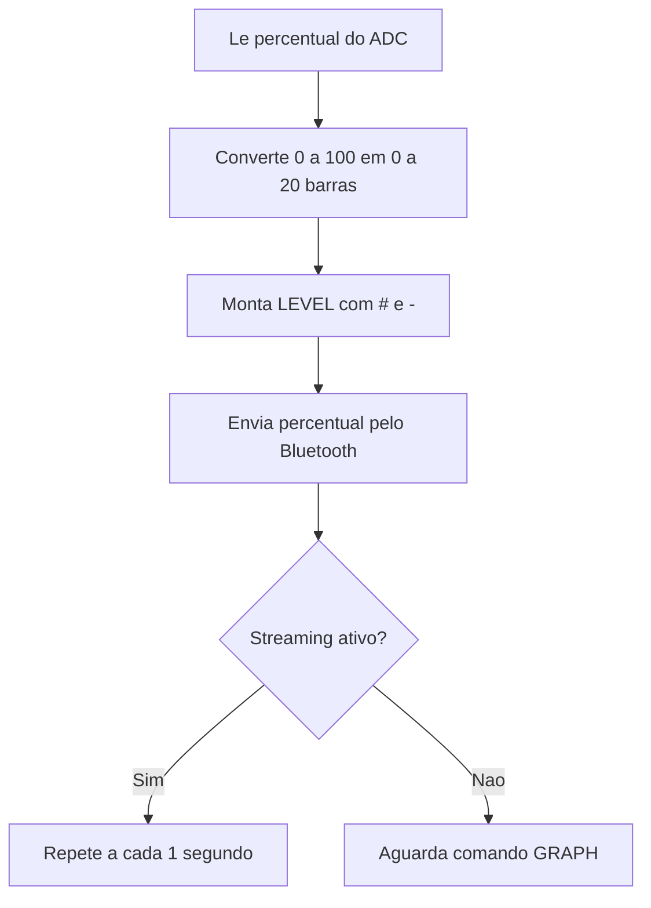
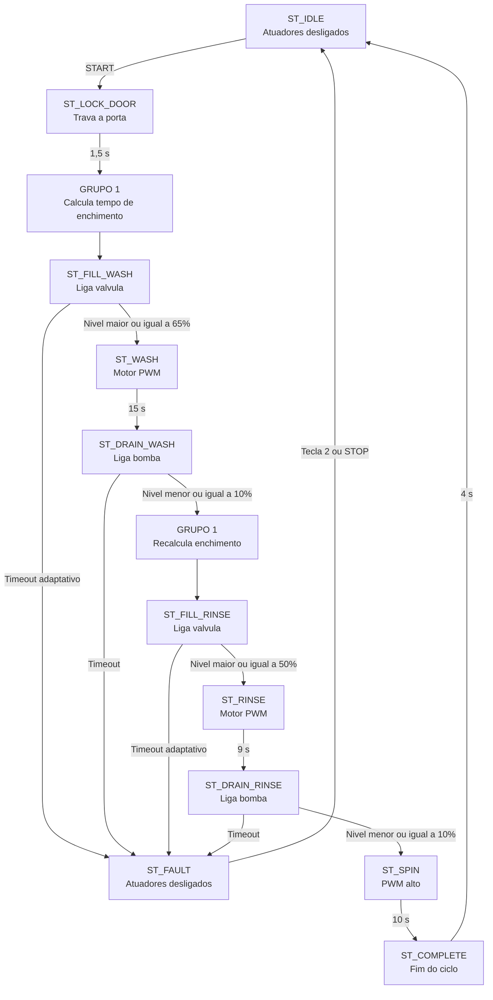

# Fluxograma do Firmware

Este documento representa o funcionamento completo do sketch `Microcontroladores.ino`, incluindo a especialização do Grupo 1.

## Fluxo Geral

## Teclado

## Bluetooth

## Controle Inteligente de Nivel

## Grafico de Nivel

## Maquina de Estados

## Especializacao do Grupo 1

- `calculateAdaptiveFillTimeout()` calcula o limite de enchimento a partir do nivel atual.
- `prepareAdaptiveFill()` aplica o calculo antes da lavagem e antes do enxague.
- `sendLevelGraph()` monta e envia o grafico textual.
- `GRAPH`, `GRAPH:ON` e `GRAPH:OFF` controlam o grafico pelo Bluetooth.
- `pushStatusIfNeeded()` transmite o nivel e o grafico a cada segundo.
