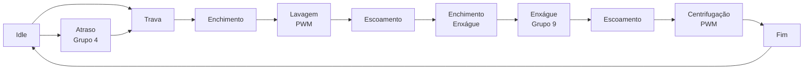

# 🧺 Firmware de Máquina de Lavar com ESP32


Projeto acadêmico de **Microcontroladores** para a **Avaliação P2 de 2026**.  
O firmware simula uma máquina de lavar doméstica usando **ESP32 Dev Module**, **LCD 16x2 I2C**, **teclado matricial 4x4**, **MCP23017**, **ADC**, **PWM**, **Bluetooth** e atuadores simulados.

> Código principal: [`Microcontroladores.ino`](Microcontroladores.ino)  
> Fluxograma completo: [`Fluxograma.md`](Fluxograma.md)

---

## ✨ Visão Geral

O sistema implementa uma máquina de estados para controlar as etapas de lavagem:



O fluxo detalhado, incluindo teclado, Bluetooth e estados de erro, está em [`Fluxograma.md`](Fluxograma.md).

---

## 🎯 Objetivos do Projeto

- Criar uma interface local com **LCD 16x2** e **teclado 4x4**.
- Simular o nível de água por **ADC** usando um potenciômetro.
- Controlar **válvula**, **bomba** e **trava de porta** por saídas digitais.
- Controlar o **motor por PWM real** no ESP32.
- Monitorar e controlar o sistema por **Bluetooth Serial**.
- Usar temporização com **`esp_timer`**, sem `delay()` e sem `millis()`.
- Implementar uma **máquina de estados** para o ciclo da máquina de lavar.

---

## 🧩 Especializações

### ⏱️ Grupo 4: Modo Atraso

Permite programar um atraso antes do início do ciclo.

**Pelo teclado**

| Tecla | Ação |
| --- | --- |
| `A` | Entra no modo de configuração do atraso |
| `0` a `9` | Digita o atraso em horas |
| `#` | Confirma o atraso |
| `*` | Cancela a edição |
| `1` | Inicia o ciclo |
| `0` | Zera o atraso configurado |

**Pelo Bluetooth**

```text
DELAY:3
START
```

Para facilitar a demonstração em bancada, cada hora configurada equivale a **15 segundos reais**:

```cpp
static const uint32_t DEMO_DELAY_PER_HOUR_MS = 15000;
```

### 💧 Grupo 9: Ciclo Econômico Adaptativo

Antes de iniciar o ciclo, o firmware lê o nível de água pelo ADC.  
Se o nível inicial estiver baixo, o modo econômico é ativado e o tempo de enxágue é reduzido.

```cpp
static const int ECO_START_THRESHOLD_PCT = 35;
static const uint32_t RINSE_BASE_MS = 9000;
static const uint32_t RINSE_ECO_MS = 5000;
```

---

## 🔌 Hardware

| Componente | Função |
| --- | --- |
| ESP32 Dev Module | Microcontrolador principal |
| LCD 16x2 I2C | Exibe estado, nível, atuadores e Bluetooth |
| MCP23017 | Expansor de IO para teclado e atuadores |
| Teclado matricial 4x4 | Entrada local de comandos |
| Potenciômetro | Simula o nível de água no ADC |
| LEDs ou relés | Simulam válvula, bomba e trava |
| Motor DC, cooler ou LED | Demonstra o PWM do motor |
| Bluetooth Serial | Controle e monitoramento remoto |

---

## 📍 Pinagem

### ESP32

| Pino | Função |
| --- | --- |
| `GPIO 21` | SDA do I2C |
| `GPIO 22` | SCL do I2C |
| `GPIO 34` | ADC do nível de água |
| `GPIO 25` | PWM do motor |

### I2C

| Dispositivo | Endereço |
| --- | --- |
| LCD 16x2 I2C | `0x20` |
| MCP23017 | `0x21` |

### MCP23017

| Pino MCP | Função |
| --- | --- |
| `0` a `3` | Linhas do teclado |
| `4` a `7` | Colunas do teclado |
| `12` | Trava de porta |
| `13` | Bomba de escoamento |
| `14` | Válvula de entrada |
| `15` | LED auxiliar de ciclo |

---

## 📲 Comandos Bluetooth

Nome do dispositivo:

```text
ESP32_G4_G9_WASHER
```

| Comando | Função |
| --- | --- |
| `PING` | Testa a conexão e responde `PONG` |
| `STATUS` | Envia estado, ADC, nível, atraso e atuadores |
| `START` | Inicia o ciclo |
| `STOP` | Cancela o ciclo |
| `ADC` | Envia a leitura atual do ADC |
| `DELAY:x` | Configura atraso remoto, exemplo: `DELAY:2` |
| `ECO?` | Informa se o modo econômico está ativo |
| `MOTOR:x` | Testa PWM manualmente, de `0` a `255` |
| `HELP` | Lista comandos principais |

---

## 🧠 Máquina de Estados

| Estado | Função |
| --- | --- |
| `ST_IDLE` | Sistema parado, atuadores desligados |
| `ST_WAIT_DELAY` | Aguarda atraso programado do Grupo 4 |
| `ST_LOCK_DOOR` | Aciona a trava da porta |
| `ST_FILL_WASH` | Enche água para lavagem |
| `ST_WASH` | Lava com PWM no motor |
| `ST_DRAIN_WASH` | Escoa água da lavagem |
| `ST_FILL_RINSE` | Enche água para enxágue |
| `ST_RINSE` | Enxágua em modo normal ou econômico |
| `ST_DRAIN_RINSE` | Escoa água do enxágue |
| `ST_SPIN` | Centrifuga com PWM mais alto |
| `ST_COMPLETE` | Finaliza e retorna ao repouso |
| `ST_FAULT` | Falha controlada por timeout |

---

## 🛠️ Bibliotecas

Instale no Arduino IDE:

- **ESP32 Arduino Core**
- **LiquidCrystal_I2C**
- **Adafruit MCP23017 Arduino Library** ou biblioteca Adafruit MCP23X17 compatível com `Adafruit_MCP23X17`

Bibliotecas nativas usadas pelo core ESP32:

- `Arduino.h`
- `Wire.h`
- `BluetoothSerial.h`
- `esp_timer.h`

---

## 🚀 Como Rodar

1. Abra `Microcontroladores.ino` no Arduino IDE.
2. Selecione a placa `ESP32 Dev Module`.
3. Escolha a porta serial correta.
4. Instale as bibliotecas necessárias.
5. Compile e envie para o ESP32.
6. Abra o monitor serial em `115200`.
7. Conecte pelo Bluetooth ao dispositivo `ESP32_G4_G9_WASHER`.

---

## 🧪 Demonstração Recomendada

| Demonstração | Como fazer |
| --- | --- |
| PWM do motor | Use `MOTOR:180` pelo Bluetooth ou observe os estados `ST_WASH`, `ST_RINSE` e `ST_SPIN` |
| Grupo 4 | Envie `DELAY:1` e depois `START`, ou configure pelo teclado com `A`, `1`, `#`, `1` |
| Grupo 9 | Deixe o potenciômetro abaixo de 35% antes de iniciar o ciclo |
| Enchimento | Gire o potenciômetro para simular o nível subindo |
| Escoamento | Gire o potenciômetro para simular o nível descendo |
| Bluetooth | Use `STATUS`, `ADC`, `ECO?`, `START` e `STOP` |

---

## 📁 Estrutura do Repositório

```text
.
├── Microcontroladores.ino
├── Fluxograma.md
├── README.md
├── LICENSE
├── .gitignore
└── .gitattributes
```

---

## 📄 Licença

Este projeto está licenciado sob a licença **MIT**.  
Consulte [`LICENSE`](LICENSE) para mais detalhes.
