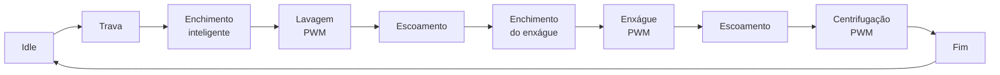

# 🧺 Firmware de Máquina de Lavar com ESP32


Projeto acadêmico de **Microcontroladores** para a **Avaliação P2 de 2026**.

O firmware simula uma máquina de lavar doméstica usando **ESP32 Dev Module**, LCD 16x2 I2C, teclado matricial 4x4, MCP23017, ADC, PWM, Bluetooth e atuadores simulados.

> Código principal: [`Microcontroladores.ino`](Microcontroladores.ino)  
> Fluxograma completo: [`Fluxograma.md`](Fluxograma.md)

---

## ✨ Visão Geral



O sistema utiliza uma máquina de estados, temporizações com `esp_timer` e comunicação Bluetooth não bloqueante.

---

## 🎯 Requisitos Implementados

- Interface local com LCD 16x2 e teclado 4x4.
- Leitura de nível de água por ADC usando potenciômetro.
- Controle digital de válvula, bomba e trava de porta.
- Controle PWM real do motor no ESP32.
- Monitoramento e controle por Bluetooth Serial.
- Temporização baseada em `esp_timer`, sem `delay()` e sem `millis()`.
- Máquina de estados para todas as etapas do ciclo.
- Tratamento de falhas por timeout de enchimento e escoamento.

---

## 💧 Grupo 1: Controle de Nível Inteligente

A especialização possui duas partes.

### Tempo de enchimento adaptativo

Antes de cada enchimento, o firmware calcula quanto falta para atingir o nível-alvo:

```text
déficit (%) = nível-alvo (%) - nível-atual (%)
tempo estimado (ms) = déficit (%) × 400 ms
```

O resultado é limitado entre 3 e 30 segundos:

```cpp
static const uint32_t FILL_MS_PER_PERCENT = 400;
static const uint32_t MIN_FILL_TIMEOUT_MS = 3000;
static const uint32_t MAX_FILL_TIMEOUT_MS = 30000;
```

Exemplo:

```text
Nível atual: 20%
Alvo da lavagem: 65%
Déficit: 45%
Tempo calculado: 45 × 400 = 18.000 ms
```

O enchimento termina assim que o ADC alcança o nível-alvo. O tempo calculado funciona como limite inteligente de segurança.

### Gráfico de nível pelo Bluetooth

O ESP32 transmite um gráfico textual do nível a cada segundo:

```text
LEVEL [############--------] 60%
```

O envio automático pode ser ativado ou desativado por Bluetooth ou pela tecla `A`.

---

## 🔌 Hardware

| Componente | Função |
| --- | --- |
| ESP32 Dev Module | Microcontrolador principal |
| LCD 16x2 I2C | Exibe estado, nível e atuadores |
| MCP23017 | Expansor de IO para teclado e atuadores |
| Teclado matricial 4x4 | Entrada local de comandos |
| Potenciômetro | Simula o nível de água |
| LEDs ou relés | Simulam válvula, bomba e trava |
| Motor DC, cooler ou LED | Demonstra o PWM do motor |
| Bluetooth Serial | Controle e gráfico remoto |

---

## 📍 Pinagem

### ESP32

| Pino | Função |
| --- | --- |
| `GPIO 21` | SDA do I2C |
| `GPIO 22` | SCL do I2C |
| `GPIO 34` | ADC do nível de água |
| `GPIO 25` | PWM do motor |

### Barramento I2C

| Dispositivo | Endereço |
| --- | --- |
| LCD 16x2 I2C | `0x20` |
| MCP23017 | `0x21` |

### MCP23017

| Pino MCP | Função |
| --- | --- |
| `0` a `3` | Linhas do teclado |
| `4` a `7` | Colunas do teclado |
| `12` | Trava de porta |
| `13` | Bomba de escoamento |
| `14` | Válvula de entrada |
| `15` | LED auxiliar de ciclo |

---

## ⌨️ Comandos do Teclado

| Tecla | Ação |
| --- | --- |
| `1` | Inicia o ciclo |
| `2` | Cancela o ciclo |
| `3` | Envia status e gráfico pelo Bluetooth |
| `A` | Liga ou desliga o gráfico automático |

---

## 📲 Comandos Bluetooth

Nome do dispositivo:

```text
ESP32_G1_WASHER
```

| Comando | Função |
| --- | --- |
| `PING` | Testa a conexão e responde `PONG` |
| `STATUS` | Envia estado, ADC, nível e atuadores |
| `START` | Inicia o ciclo |
| `STOP` | Cancela o ciclo |
| `ADC` | Envia a leitura atual do ADC |
| `GRAPH` | Envia um gráfico imediatamente |
| `GRAPH:ON` | Ativa o gráfico automático |
| `GRAPH:OFF` | Desativa o gráfico automático |
| `MOTOR:x` | Testa o PWM de `0` a `255` |
| `HELP` | Lista os comandos |

---

## 🧠 Máquina de Estados

| Estado | Função |
| --- | --- |
| `ST_IDLE` | Sistema parado |
| `ST_LOCK_DOOR` | Aciona a trava da porta |
| `ST_FILL_WASH` | Enchimento inteligente para lavagem |
| `ST_WASH` | Lavagem com PWM |
| `ST_DRAIN_WASH` | Escoamento da lavagem |
| `ST_FILL_RINSE` | Enchimento inteligente para enxágue |
| `ST_RINSE` | Enxágue com PWM |
| `ST_DRAIN_RINSE` | Escoamento do enxágue |
| `ST_SPIN` | Centrifugação com PWM mais alto |
| `ST_COMPLETE` | Finalização do ciclo |
| `ST_FAULT` | Estado seguro após timeout |

---

## 🛠️ Bibliotecas

Instale no Arduino IDE:

- **ESP32 Arduino Core**
- **LiquidCrystal_I2C**
- **Adafruit MCP23017 Arduino Library** ou biblioteca compatível com `Adafruit_MCP23X17`

Bibliotecas nativas do core ESP32:

- `Arduino.h`
- `Wire.h`
- `BluetoothSerial.h`
- `esp_timer.h`

---

## 🚀 Como Executar

1. Abra `Microcontroladores.ino` no Arduino IDE.
2. Selecione a placa `ESP32 Dev Module`.
3. Selecione a porta serial correta.
4. Instale as bibliotecas necessárias.
5. Compile e envie o firmware.
6. Abra o monitor serial em `115200`.
7. Conecte ao Bluetooth `ESP32_G1_WASHER`.

---

## 🧪 Roteiro de Demonstração

| Demonstração | Procedimento |
| --- | --- |
| Nível inteligente | Posicione o potenciômetro em níveis diferentes antes de cada enchimento e mostre `FILL_ESTIMATE_MS` |
| Gráfico Bluetooth | Envie `GRAPH:ON` e gire o potenciômetro |
| Enchimento | Aumente gradualmente o potenciômetro até o nível-alvo |
| Escoamento | Reduza gradualmente o potenciômetro até 10% |
| PWM do motor | Observe lavagem, enxágue e centrifugação ou envie `MOTOR:180` |
| Falha de segurança | Não altere o nível durante o enchimento e aguarde o timeout adaptativo |

---

## 📁 Estrutura

```text
.
├── Microcontroladores.ino
├── Fluxograma.md
├── README.md
├── LICENSE
├── .gitignore
└── .gitattributes
```

---

## 📄 Licença

Distribuído sob a licença **MIT**. Consulte [`LICENSE`](LICENSE).
